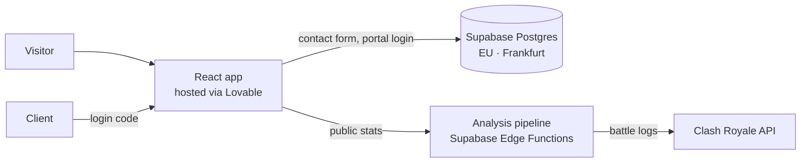

# Rukawa Analytics

**Live:** [rukawaanalytics.com](https://rukawaanalytics.com)

Portfolio and client platform of **Till Oscar Jacob ("Rukawa")**, a Clash Royale esports analyst focused on Solo CRL player preparation. The site presents the analysis method, publishes case studies, shows live numbers from my analysis pipeline, and gives players and teams a private portal for their prep material.

> Short version: I turn a player's battle log into set decisions — and I built the tooling that does it.

## What's in this repo

| Area | What it does |
|---|---|
| **Portfolio** (`/`) | Method, current engagements, results, team history, contact |
| **Case studies** (`/work`, `/work/:slug`) | Written as Markdown in `src/content/case-studies/`, rendered in the app |
| **Live stats** | Pulls aggregated, public numbers from my separate analysis pipeline (private repo) |
| **Client portal** (`/portal`) | Players see their deck sets, teams see opponent analyses — access via personal login code |
| **Admin panel** (`/admin`) | Manage clients, deck sets and analysis files |
| **Contact** | Contact form (stored in Supabase) and optional call booking |
| **Strompreis-Kompass** (`/strompreis`) | German electricity price dashboard built on official Bundesnetzagentur data, see [docs](docs/strompreis-kompass/README.md) |
| **Race Strategy Lab** (`/race-strategy`) | Tyre strategy, tyre wear, race pace and pit stop analysis for every Grand Prix since 2023 (OpenF1 data), see [docs](docs/race-strategy-lab/README.md) |

Featured case study: [From Battle Log to Set Decision](src/content/case-studies/player-analysis-tooling.md) — how up to 1,000 recent battles per player become slot-based tendencies (Game 1/2/3) and remaining-deck predictions.

Data case study (German): [Wann Strom am günstigsten ist](src/content/case-studies/strompreis-kompass.md) — a year of German exchange electricity prices analysed in SQL; every number in it can be reproduced with [`docs/strompreis-kompass/analysis.sql`](docs/strompreis-kompass/analysis.sql).

## Architecture



- **Frontend:** React, TypeScript, Vite, Tailwind CSS, shadcn/ui, Framer Motion, GSAP
- **Backend:** Supabase (Postgres, Row Level Security, Edge Functions), both projects hosted in the EU (Frankfurt)
- **Analysis pipeline:** separate private project — scheduled collection of battle logs, duel/set detection, deck hashing, meta aggregation, self-healing tracking
- **Database schema:** versioned in [`supabase/migrations`](supabase/migrations). The 2026 migrations (privacy retention job, Strompreis-Kompass, Race Strategy Lab) carry the same version numbers as in the live database; readable one-file versions are in [`docs/strompreis-kompass/schema.sql`](docs/strompreis-kompass/schema.sql) and [`docs/race-strategy-lab/schema.sql`](docs/race-strategy-lab/schema.sql).

## Security & privacy decisions

- Client data is only reachable through `SECURITY DEFINER` database functions (`*_secure`) with session tokens — no direct table access from the browser.
- Portal logins and the contact form are rate-limited.
- Personal data is deleted automatically after the retention periods stated in the privacy policy (daily `pg_cron` job, see [`20260923124846_privacy_retention_cleanup_job.sql`](supabase/migrations/20260923124846_privacy_retention_cleanup_job.sql)).
- The key in `.env` is Supabase's **publishable (anon) key**, which is meant to be public; access control lives in RLS policies and the secure functions.
- Fonts and map data are bundled with the site instead of loaded from third-party CDNs; the Cal.com scheduler only loads after a visitor clicks "Book a call".

## How it was built

I designed the product, data model and analysis logic; the code was written AI-assisted using [Lovable](https://lovable.dev) and other AI tools. I operate and maintain the system myself. Changes made in Lovable are committed to this repo automatically.

### Run locally

Requires Node.js 18+.

```sh
git clone https://github.com/tojacob03/rukawa-clash-arena.git
cd rukawa-clash-arena
npm install
npm run dev
```

Checks — the same three run in CI ([`.github/workflows/ci.yml`](.github/workflows/ci.yml)) on every push:

```sh
npm run lint
npm run typecheck
npm run build
```

## Contact

[Website](https://rukawaanalytics.com/#contact) · [LinkedIn](https://www.linkedin.com/in/till-oscar-jacob-846403358) · [X / Twitter](https://twitter.com/RukawaAnalyst)

---

This material is unofficial and is not endorsed by Supercell. For more information see [Supercell's Fan Content Policy](https://www.supercell.com/fan-content-policy).
