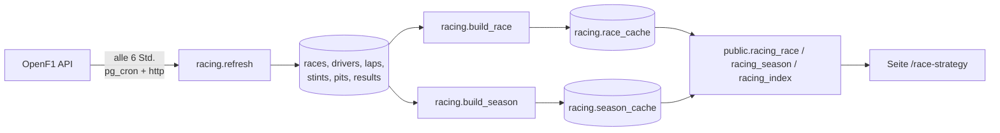

# Race Strategy Lab

**Live:** [rukawaanalytics.com/race-strategy](https://rukawaanalytics.com/race-strategy)

Tyre strategy, tyre wear, race pace and pit stop analysis for every Grand Prix since 2023. Unofficial project, not associated with the Formula 1 companies. Data: [OpenF1](https://openf1.org) (historical data is free, no key needed).

## Architektur



Alles läuft wie beim Strompreis-Kompass in der Datenbank **Rukawa Portfolio**, hier im Schema `racing`. Keine Zusatzkosten, kein Server, kein API-Schlüssel.

**Rate Limit:** OpenF1 erlaubt kostenlos 3 Anfragen pro Sekunde und 30 pro Minute. `racing.fetch` wartet deshalb 2,1 Sekunden vor jeder Anfrage und bei HTTP 429 zusätzlich 20 Sekunden. Live-Daten (bis 30 Minuten nach Sessionende) sind kostenpflichtig, deshalb wird ein Rennen erst 2 Stunden nach dem Ende geladen.

## Datenmodell

| Tabelle | Inhalt |
|---|---|
| `racing.races` | Rennkalender (nur Hauptrennen), `loaded_at` = wann zuletzt geladen |
| `racing.drivers` | Fahrer pro Rennen mit Team und Teamfarbe |
| `racing.laps` | Jede Runde jedes Fahrers mit Zeit und Out-Lap-Kennzeichen |
| `racing.stints` | Reifenstints: Mischung, erste und letzte Runde, Alter beim Aufziehen |
| `racing.pits` | Boxenstopps: Zeit in der Boxengasse und Standzeit |
| `racing.results` | Endergebnis mit Position, Punkten, DNF/DNS/DSQ |
| `racing.race_cache`, `racing.season_cache` | Fertig berechnete Auswertungen als JSON |
| `racing.ingest_runs` | Protokoll jedes Abrufs, 90 Tage |

Das komplette SQL steht in [`schema.sql`](schema.sql): jede Funktion einmal, in ihrer aktuellen Fassung. Die Methode unten steckt in `racing.build_race` und `racing.build_season`. So, wie es in der Datenbank angewendet wurde, liegt das SQL als vier Migrationen in [`supabase/migrations`](../../supabase/migrations) (`20260923230453` bis `20260923230809`).

## Methode

1. **Saubere Runden:** ab Runde 2, keine Out-Laps, keine In-Laps (Runde mit Boxenstopp), höchstens 107 % des Rennmedians. Das filtert Safety-Car-Phasen, Dreher und Verkehr in der Startphase.
2. **Kraftstoffkorrektur:** Ein Auto wird pro Runde etwa 0,06 s schneller, weil Sprit verbrennt. Korrigierte Zeit = Rundenzeit − 0,06 × (verbleibende Runden). Ohne Korrektur würde der Reifenverschleiß unterschätzt. Die 0,06 s sind ein Schätzwert.
3. **Reifenverschleiß:** Für jeden Stint mit mindestens 6 sauberen Runden rechnet `regr_slope()` die Steigung der korrigierten Rundenzeit über das Reifenalter. Die Steigungen werden je Mischung gemittelt.
4. **Race Pace:** Median der korrigierten sauberen Runden je Fahrer (mindestens 10), als Abstand zum schnellsten.
5. **Boxenstopps:** Median der Standzeit je Team und Saison, Stopps über 10 s (Probleme, Strafen) ausgeschlossen.

## Betrieb

```sql
-- Letzte Abrufe
select target, status, detail, finished_at from racing.ingest_runs order by id desc limit 10;

-- Sofort nach neuen Rennen sehen (lädt maximal 3 Rennen)
select racing.refresh(3);

-- Ein Rennen neu laden und neu auswerten
select racing.ingest_race(9839);
select racing.build_race(9839);
select racing.build_season(2025);
```

Der Job `racing-refresh` läuft alle 6 Stunden. Die einmalige Historie wurde vom Job `racing-backfill` geladen, der sich danach selbst beendet hat.

## SQL-Übungen

1. Welcher Fahrer hatte 2025 die meisten Boxenstopps insgesamt?
2. Wie viele Runden wurden je Reifenmischung pro Saison gefahren?
3. Welche Strecke hat die längste Zeit in der Boxengasse? *Tipp: `percentile_cont(0.5) within group (order by lane_duration)` je Rennen*
4. Wie oft hat der Fahrer von Startplatz 1 gewonnen? *Tipp: dafür fehlen noch Daten, welche müsstest du zusätzlich laden?*
5. Rechne den Reifenverschleiß für einen einzelnen Stint selbst nach. *Tipp: `regr_slope(y, x)`*
