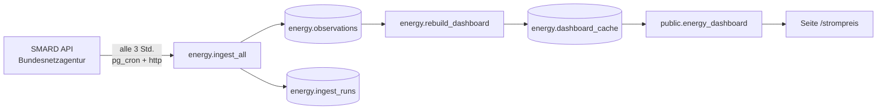

# Strompreis-Kompass

**Live:** [rukawaanalytics.com/strompreis](https://rukawaanalytics.com/strompreis)

Zeigt, wann Strom an der Börse am günstigsten ist, und wertet Muster im deutschen Strommarkt aus. Datenquelle sind die offiziellen Strommarktdaten der Bundesnetzagentur ([SMARD.de](https://www.smard.de), Lizenz CC BY 4.0).

## Architektur



Alles läuft in der bestehenden Supabase-Datenbank **Rukawa Portfolio** (Frankfurt), im eigenen Schema `energy`. Es gibt keinen eigenen Server und keine Edge Function: Die Datenbank holt die Daten selbst (Erweiterung `http`) und plant die Abrufe selbst (Erweiterung `pg_cron`).

**Kosten:** keine zusätzlichen. Kein neues Supabase-Projekt, keine neue Domain, kein neues Lovable-Projekt. Der Datenbestand ist klein (rund 70 MB).

**Sicherheit:** Das Schema `energy` ist von außen nicht erreichbar. Die Website kann nur die Funktion `public.energy_dashboard()` aufrufen, und die liefert ein fertig berechnetes JSON. Auch viele Aufrufe belasten die Datenbank deshalb kaum.

## Datenmodell

| Tabelle | Inhalt |
|---|---|
| `energy.series` | Welche Zeitreihen gesammelt werden (SMARD-Filter-ID, Region, Einheit) |
| `energy.observations` | Die Messwerte: eine Zeile pro Zeitreihe, Auflösung und Zeitpunkt |
| `energy.ingest_runs` | Protokoll jedes Abrufs (Erfolg, Anzahl Werte, Fehlermeldung), 60 Tage |
| `energy.dashboard_cache` | Das fertige Dashboard-JSON, wird nach jedem Abruf neu gebaut |

Gesammelte Zeitreihen:

| key | SMARD-Filter | Bedeutung | Einheit |
|---|---|---|---|
| `price` | 4169 (DE-LU) | Day-Ahead-Großhandelspreis | €/MWh |
| `solar` | 4068 | Erzeugung Photovoltaik | MWh pro Intervall |
| `wind_onshore` | 4067 | Erzeugung Wind an Land | MWh pro Intervall |
| `wind_offshore` | 1225 | Erzeugung Wind auf See | MWh pro Intervall |
| `load` | 410 | Stromverbrauch (Netzlast) | MWh pro Intervall |
| `residual_load` | 4359 | Residuallast (Verbrauch minus Wind und Solar) | MWh pro Intervall |

Auflösungen: `quarterhour` seit 1. Oktober 2025 (seitdem handelt die Börse in Viertelstunden), `hour` seit Januar 2023. Zeitpunkte sind als `timestamptz` gespeichert. Für deutsche Uhrzeiten immer `ts at time zone 'Europe/Berlin'` verwenden, sonst sind die Stunden bei Sommer-/Winterzeit verschoben.

Das komplette SQL steht in [`schema.sql`](schema.sql). So, wie es in der Datenbank angewendet wurde, liegt es als drei Migrationen in [`supabase/migrations`](../../supabase/migrations) (`20260923165736` bis `20260923170158`).

## Betrieb

Alles läuft automatisch. Zum Nachsehen im Supabase-Dashboard (Projekt *Rukawa Portfolio* → SQL Editor):

```sql
-- Letzte Abrufe: alles "ok"?
select series_key, resolution, finished_at, rows_upserted, status, error
from energy.ingest_runs
order by id desc
limit 12;

-- Einen Abruf sofort von Hand starten (holt die letzten 2 Wochen-Pakete)
select energy.ingest_all(2);

-- Historie für eine Zeitreihe nachladen, z. B. nach längerem Ausfall
select energy.ingest('price', 'quarterhour', null, '2026-01-01');
```

Der Abruf-Job heißt `energy-ingest` und läuft alle drei Stunden (Minute 10). Du findest ihn im Dashboard unter Integrations → Cron.

Wenn SMARD etwas an der Schnittstelle ändert, erscheinen Fehler in `energy.ingest_runs`, die Seite zeigt dann einfach die zuletzt erfolgreichen Daten.

## Woche 2: SQL-Übungen

Die Aufgaben steigen im Schwierigkeitsgrad. Alle sind reine Abfragen (`select`), du kannst also nichts kaputt machen. Vorgehen: Frage lesen, erst selbst überlegen, dann eine KI um einen Vorschlag bitten und sie **jede Zeile erklären lassen**, danach die Abfrage selbst abwandeln.

**Beispiel mit Lösung:** Wie viele Werte liegen pro Zeitreihe und Auflösung in der Datenbank?

```sql
select series_key, resolution, count(*) as anzahl, min(ts) as von, max(ts) as bis
from energy.observations
group by series_key, resolution
order by series_key, resolution;
```

1. Was war der teuerste und der günstigste Viertelstundenpreis seit Oktober 2025, und wann genau (deutsche Uhrzeit)? *Tipp: `order by value desc limit 1`*
2. Wie hoch war der Durchschnittspreis pro Monat im Jahr 2024 und im Jahr 2025? *Tipp: `date_trunc('month', ...)`*
3. An wie vielen Tagen pro Monat gab es mindestens eine Stunde mit negativem Preis? *Tipp: erst pro Tag zählen, dann pro Monat*
4. Wie teuer ist Strom im Schnitt zu jeder Uhrzeit (0 bis 23 Uhr)? *Tipp: `extract(hour from ts at time zone 'Europe/Berlin')`*
5. Ist Strom am Wochenende günstiger als unter der Woche? Um wie viel Prozent?
6. Wie groß war der Solaranteil am Verbrauch pro Monat? *Tipp: Zeitreihen nebeneinander stellen mit `max(value) filter (where series_key = 'solar')`*
7. Wie stark hängen Tagespreis und Wind-plus-Solar-Anteil zusammen? *Tipp: `corr(x, y)`*
8. Welches 2-Stunden-Fenster war an einem bestimmten Tag am günstigsten? *Tipp: Fensterfunktion `avg(value) over (order by ts rows between current row and 7 following)`*
9. Wie hoch war der Preis im Schnitt bei Windflaute (Windanteil unter 10 %) im Vergleich zu viel Wind (über 50 %)?
10. Deine eigene Frage. Was würdest du als Wiwi-Student über den Strommarkt wissen wollen?

Jede Abfrage, die dir eine interessante Antwort liefert, ist ein Kandidat für die Case Study.

## Case Study

Die Case Study [„Wann Strom am günstigsten ist“](https://rukawaanalytics.com/work/strompreis-kompass) ([Quelltext](../../src/content/case-studies/strompreis-kompass.md)) wertet ein Jahr Börsenstrompreise aus: Tageszeit, Jahreszeit, Wind- und Solaranteil, negative Preise. Jede Zahl darin lässt sich mit den Abfragen in [`analysis.sql`](analysis.sql) nachrechnen; die Ergebnisse vom 24.09.2026 stehen jeweils darunter.

## Quelle und Lizenz

Daten: Bundesnetzagentur | SMARD.de, Lizenz [CC BY 4.0](https://creativecommons.org/licenses/by/4.0/deed.de). Die Quellenangabe muss auf jeder Seite stehen, die die Daten zeigt. Es handelt sich um Großhandelspreise ohne Steuern, Umlagen und Netzentgelte.
